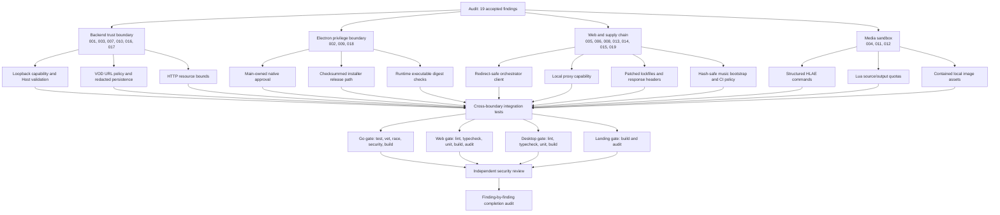
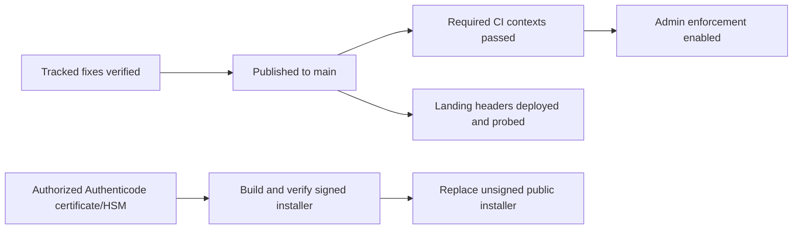

# Security remediation graph and subagent workflow

Date: 2026-07-23
Source of truth: `SECURITY_AUDIT.md`
Scope: implement and verify all `FF-SEC-001` through `FF-SEC-019`

## Dependency graph

## Implementation workflow

| Wave | Agent | Write ownership | Findings | Required proof |
| --- | --- | --- | --- | --- |
| 1 | `backend_security` | `cmd/zv-orchestrator`, `internal/httpapi`, `internal/vodfetch`, stream repository/types | 001, 003, 007, 010, 016, 017 | Focused Go tests plus affected package tests |
| 1 | `desktop_security` | `desktop/src`, desktop release scripts/config/tests/docs | 002, 009, 018 | Desktop lint, typecheck, unit, build |
| 1 | `web_supply_security` | `web` server boundary, `landing`, lockfiles, music script, CI/gitignore | 005, 006, 008, 013, 014, 015, 019 | Web/landing gates and production audits |
| 1 | coordinator | `internal/recording`, `internal/editor`, related tests | 004, 011, 012 | Focused Go tests and adversarial regression tests |
| 2 | `go_security_review` | Read-only review; patches only if explicitly reassigned | Backend and media changes | No unresolved actionable security findings |
| 2 | `ts_security_review` | Read-only review; patches only if explicitly reassigned | Desktop, web, landing, supply changes | No unresolved actionable security findings |
| 2 | `integration_verifier` | Test and evidence ownership | All 19 findings | Requirement matrix with authoritative evidence |

Only the assigned owner edits a surface during wave 1. The coordinator resolves integration conflicts after all three agents stop. Review agents do not overwrite implementation agents.

## Security contracts to preserve

- The demo remains the source of truth for player identity and recording decisions.
- Every expensive or destructive Studio action requires approval outside the untrusted content renderer.
- The browser never receives orchestrator credentials.
- Local HTTP authorities are explicit loopback literals and use an unguessable session capability.
- Remote VOD acquisition cannot reach loopback, private, link-local, multicast, reserved, or rebinding destinations.
- Persisted/public stream DTOs never contain URL userinfo or secret query material.
- External effects scripts cannot access arbitrary files, URLs, UNC/device paths, or unbounded memory/output.
- External commands use fixed executables and argv, never a shell-expanded string.
- Release artifacts require verified SHA-256 checksums; Authenticode remains an open hardening item.
- Downloaded inputs are hash-verified before atomic promotion.

## Completion rule

A finding is complete only when:

1. the vulnerable path is removed or bounded at its owning boundary;
2. a regression test exercises the former exploit or invariant;
3. the relevant package gate passes;
4. `SECURITY_AUDIT.md` records the fix and proof;
5. independent review finds no actionable regression.

Missing external credentials do not justify a fake success. FF-SEC-009 remains
open until a publicly trusted signing identity is available; it does not block
the established checksummed unsigned installer release flow.

## Execution result

Wave 1 completed across the backend, Electron, web/supply-chain, and media
sandbox owners. Wave 2 completed with independent Go, TypeScript, and media
reviewers. Reviewers found and drove corrections for:

- Lua `load`/`loadstring` and `table.concat` quota bypasses;
- writable runtime-tool manifests being treated as a trust root;
- an expired rotating FFmpeg download;
- HTMX upload concurrency omission;
- post-resolution listener and shared-loopback limiter risks;
- cross-process capability leakage in standalone and Electron launchers;
- release-signing configuration being introduced before a public signing
  identity was available.

All required local and GitHub code gates in the graph are green. The tracked
workflow is live, administrator enforcement is enabled, Dependabot has zero
open alerts, and Vercel serves the landing security headers. The implementation
state and proof for every finding are recorded in `SECURITY_AUDIT.md`.

One operational node remains outside the repository:

The remediation was committed and pushed directly to `main`, CI passed, and the
landing was deployed automatically. Installer releases continue with verified
SHA-256 checksums while FF-SEC-009 remains open. The immutable
FFmpeg runtime archive was uploaded to the existing v2.2.12 release because the
upstream rotating autobuild URL had already expired; its source and
extracted-tree SHA-256 values are pinned in the desktop runtime.
